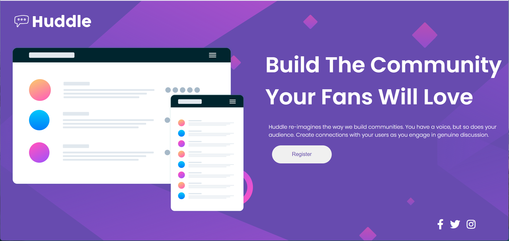

# Projeto Huddle Base - Frontend Mentor

Este projeto do Frontend Mentor foi um desafio do meu curso de Programação de Desenvolvimento Web Frontend visando aplicar os conhecimentos de Flexbox para resolver este desafio. 

## Versão Desktop

O *display flex* foi essencial neste layout. Ele permitiu, com muito mais facilidade, mover os elementos e alinhá-los. 

## Versão Mobile

Para a versão mobile foi utilizada *media query (max-width: 1200px)* permitindo que o layout pudesse se ajustar para telas médias e pequenas. 

## Tecnologias Utilizadas

HTML e CSS, além do Flexbox.

## Conclusão

Incrível perceber minha evolução desde o início do curso, os projetos anteriores, até o momento. Cada dia tem ficado mais fácil aplicar o que venho aprendendo. 